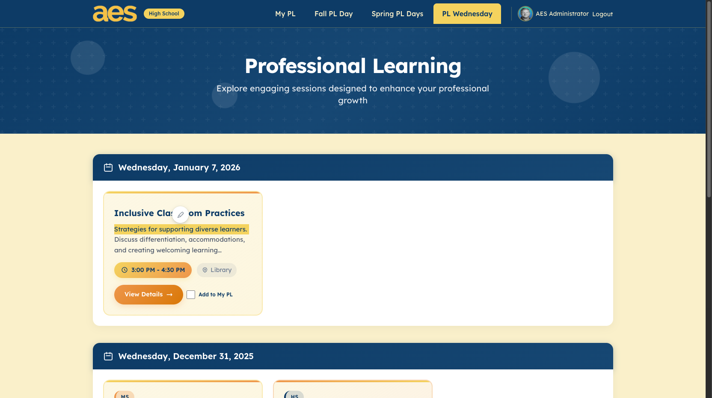
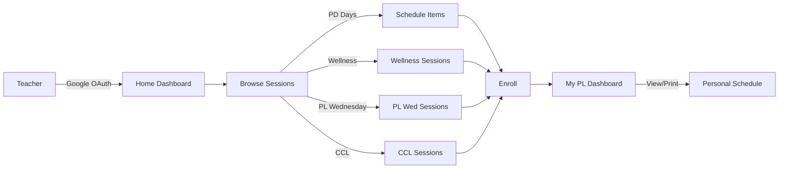
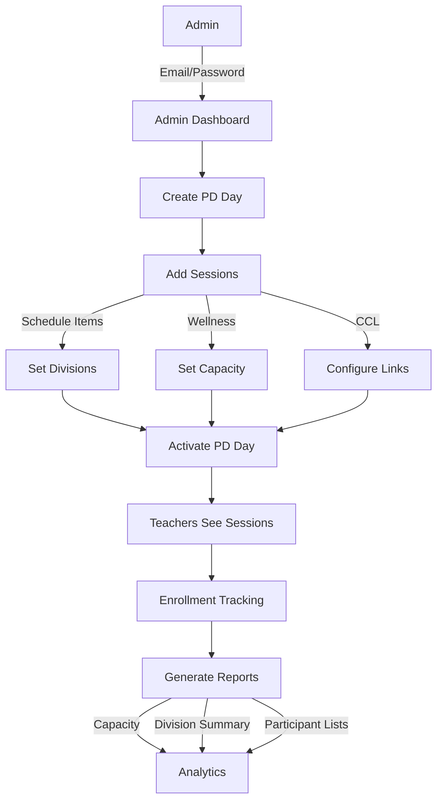
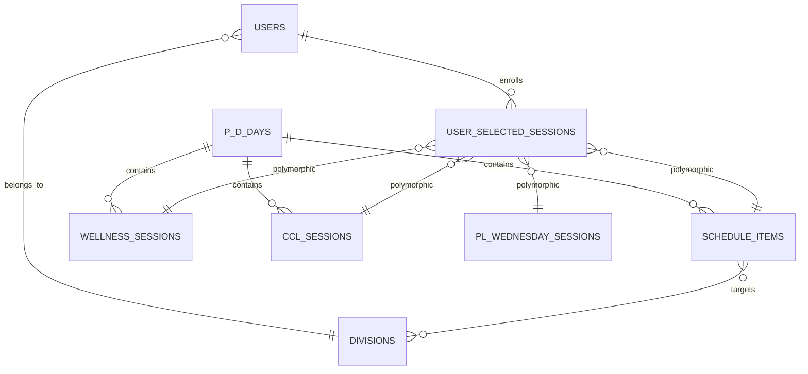
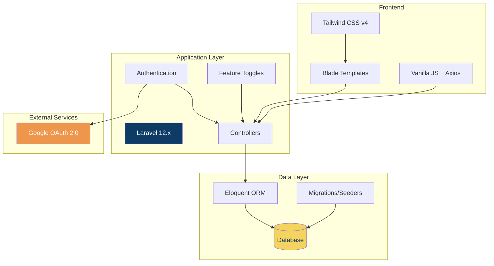
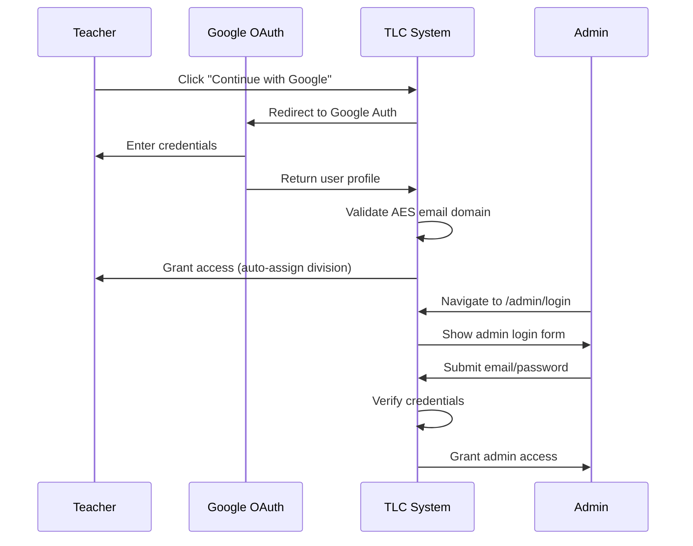
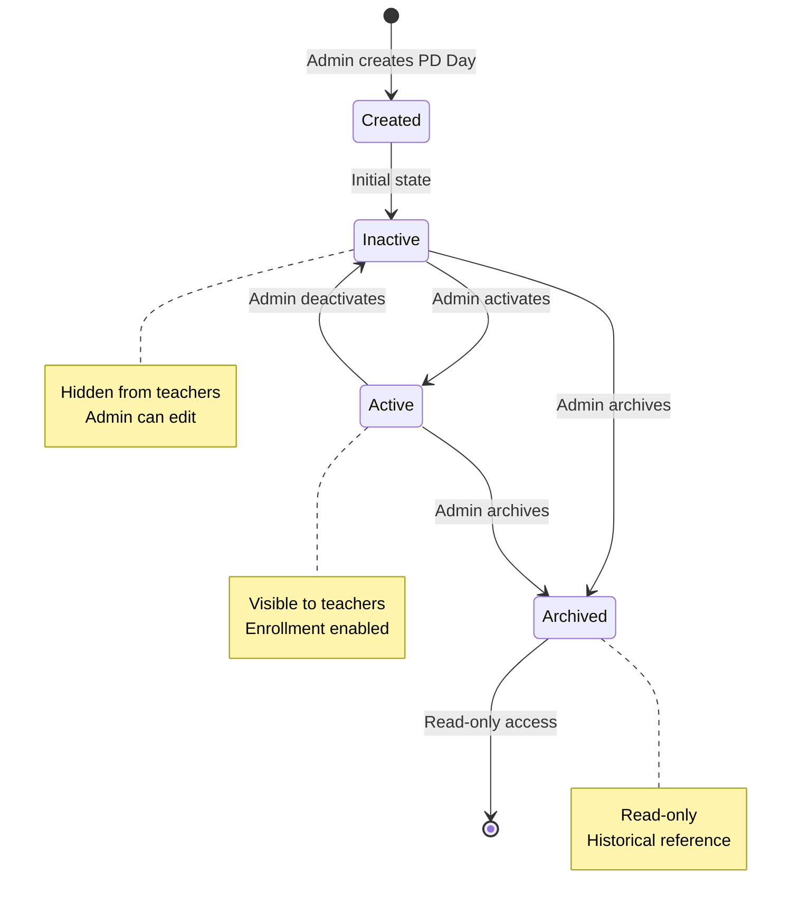
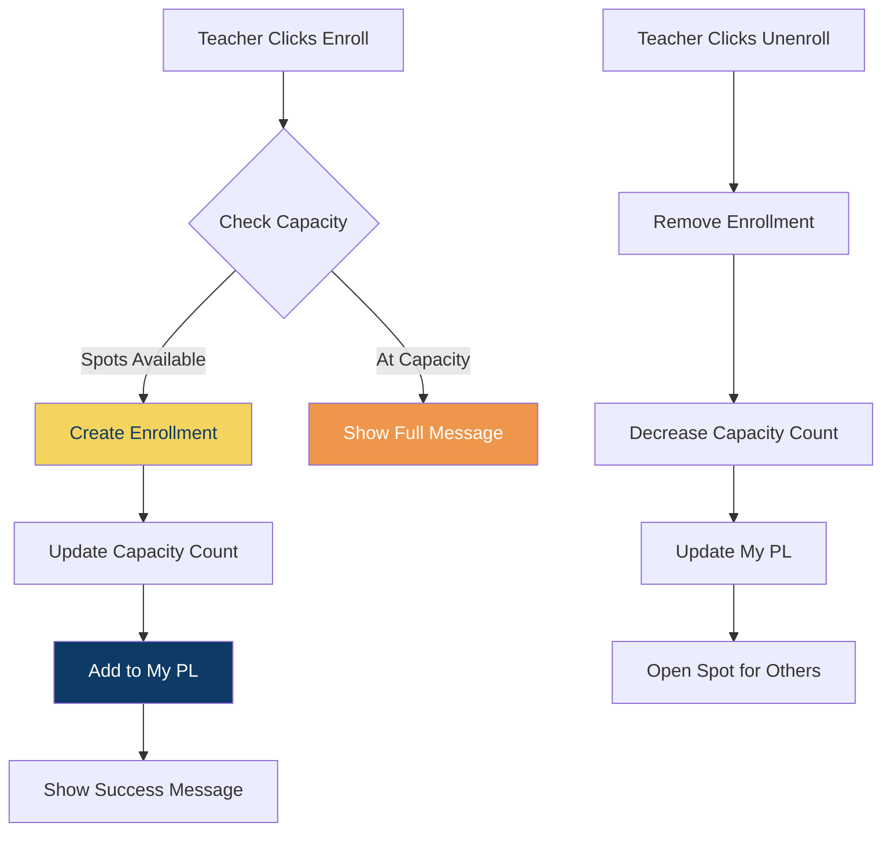

# TLC 2.0 - Professional Learning Management System

**Empowering Teacher Professional Growth at the American Embassy School**

TLC 2.0 is a comprehensive platform that streamlines how teachers at AES discover, enroll in, and track their professional development. The system replaces manual sign-up processes with an intuitive digital experience, enabling teachers to browse division-specific sessions (Elementary, Middle, High School), manage their learning calendar, and administrators to coordinate PD programs with real-time capacity tracking and analytics.



## What Problem Does TLC Solve?

**For Teachers:**
- **Discovery Challenge** - Teachers previously struggled to find relevant PD sessions across multiple programs (PD Days, Wellness, PL Wednesday, CCL). TLC provides a unified catalog with division-based filtering.
- **Enrollment Friction** - Manual sign-up sheets and email chains are replaced with one-click enrollment and instant capacity updates.
- **Schedule Management** - "My PL" dashboard consolidates all enrolled sessions across different programs into a single printable schedule.

**For Administrators:**
- **Coordination Complexity** - Creating and managing multiple PD days with dozens of sessions is streamlined with bulk operations, CSV import, and session copying.
- **Capacity Blind Spots** - Real-time enrollment tracking prevents over-booking and provides visibility into session popularity.
- **Reporting Gaps** - Built-in analytics show capacity utilization, division breakdowns, and participant lists for better program planning.

### Real-World Example

**Before TLC 2.0:**
> "A high school teacher wants to attend a wellness session during the Fall PD Day. They check their email for the sign-up spreadsheet link, navigate to find sessions for HS teachers, manually add their name to a Google Sheet, hope it's not full, then separately track which schedule sessions they're attending. On PD Day morning, they piece together their schedule from multiple sources."

**With TLC 2.0:**
> "The teacher logs in with their AES Google account, immediately sees sessions tagged for High School, clicks 'Add to My PL' on the wellness session (capacity shown as 8/15), browses schedule items, adds two more sessions, then visits 'My PL' to see their complete day schedule. They print it or view it on their phone throughout the day."

## Table of Contents

- [What Problem Does TLC Solve?](#what-problem-does-tlc-solve)
- [How It Works](#how-it-works)
- [Overview](#overview)
- [Information Flow](#information-flow)
- [Core Features](#core-features)
- [Quick Start](#quick-start)
- [System Architecture](#system-architecture)
- [Technology Stack](#technology-stack)
- [Architecture Details](#architecture-details)
- [Database Schema](#database-schema)
- [Development Commands](#development-commands)

## How It Works

### For Teachers

1. **Sign In** - Use your AES Google account to log in (division auto-detected from email)
2. **Browse Sessions** - View upcoming PD sessions filtered by your division (ES/MS/HS)
3. **Enroll** - Click "Add to My PL" on sessions that interest you (capacity shown in real-time)
4. **Track** - Visit "My PL" to see all your enrolled sessions across all programs
5. **Print** - Export your personal schedule for offline reference

**Session Types Available:**
- **PD Days** - Full-day professional development sessions (Fall & Spring)
- **Wellness Sessions** - Physical and mental wellness activities during PD Days
- **PL Wednesday** - Weekly professional learning sessions (Wednesdays 3:00-5:00 PM)
- **CCL** - Collaborative Community Learning sessions throughout the year

### For Administrators

1. **Create PD Day** - Define dates and activate when ready for teacher viewing
2. **Add Sessions** - Manually create sessions or bulk import via CSV
3. **Set Parameters** - Assign divisions, set capacity limits, add session links
4. **Monitor Enrollments** - Track real-time enrollment numbers and capacity
5. **Generate Reports** - Export participant lists, capacity utilization, division summaries
6. **Manage Programs** - Use feature toggles to enable/disable entire programs

## Overview

TLC 2.0 centralizes professional learning management with dual interfaces: a teacher portal for browsing and enrolling in sessions, and an admin dashboard for program coordination. The system supports multiple PD formats with division-specific filtering (ES/MS/HS) and capacity management.

**Key Capabilities:**
- 🎯 **Session Discovery** - Teachers browse PD sessions by division and time
- 📅 **My PL Dashboard** - Unified view of all enrolled sessions across programs
- 🔄 **Flexible Enrollment** - Add/remove sessions with real-time capacity tracking
- 📊 **Admin Reporting** - Track enrollments, capacity, and participation
- 🏷️ **Feature Toggles** - Enable/disable programs globally (PD Days, Wellness, PL Wed, CCL)

## Information Flow

### User Journey



### Admin Workflow



### Data Architecture



## Core Features

### 👥 For Teachers
- **My PL** - Personal dashboard showing all enrolled sessions across programs
- **Session Browser** - Filter by division (ES/MS/HS), date, and session type
- **One-Click Enrollment** - Add sessions with real-time capacity updates
- **Print Schedule** - Export personal schedule for offline reference

### 🛠️ For Administrators
- **PD Day Management** - Create/edit/archive PD Days with active/inactive states
- **Bulk Operations** - CSV import, copy sessions between PD Days
- **Enrollment Management** - Transfer users, adjust capacity, track waitlists
- **Reporting Suite** - Capacity utilization, division summaries, participant lists, CCL enrollments
- **Feature Toggles** - Enable/disable entire programs globally

## Quick Start

```bash
# 1. Clone and install dependencies
git clone https://github.com/rottnerin/tlcapp.git
cd tlcapp
composer install && npm install

# 2. Configure environment
cp .env.example .env
php artisan key:generate

# 3. Set up database
php artisan migrate --seed

# 4. Start development (runs server, queue, logs, Vite)
composer dev
```

Access the application at `http://localhost:8000`

### Environment Setup

```env
# Database
DB_CONNECTION=sqlite
DB_DATABASE=/absolute/path/to/database.sqlite

# Google OAuth (Required for teacher login)
GOOGLE_CLIENT_ID=your-client-id
GOOGLE_CLIENT_SECRET=your-client-secret
GOOGLE_REDIRECT_URI=http://localhost:8000/auth/google/callback
```

## Screenshots

### Professional Learning Sessions Interface

Teachers browse sessions by date with clear session details, location, time, and one-click enrollment:


**Key UI Features:**
- **Division Badge** - Shows which school divisions each session targets (ES/MS/HS)
- **Session Cards** - Display title, description, time, location, and presenter
- **Add to My PL** - One-click enrollment with instant capacity feedback
- **View Details** - Expandable session information with links and resources
- **Date Grouping** - Sessions organized chronologically for easy scanning
- **Navigation** - Quick access to My PL, Fall PL Day, Spring PL Days, and PL Wednesday

## System Architecture



## Technology Stack

| Layer | Technology | Purpose |
|-------|-----------|---------|
| **Framework** | Laravel 12.x | Backend application framework |
| **Frontend** | Blade, Tailwind CSS v4, Vite | Server-rendered templates with utility CSS |
| **JavaScript** | Vanilla JS, Axios | Minimal client-side interactivity |
| **Authentication** | Google OAuth, Email/Password | Dual auth system (users/admins) |
| **Database** | SQLite / MySQL / PostgreSQL | Flexible data storage |
| **PHP** | 8.2+ | Server runtime |


## Architecture Details

### Authentication Flow



### PD Day Lifecycle



### Feature Toggle System

Each program has a global toggle controlling visibility:

| Feature | Setting Model | Controls |
|---------|---------------|----------|
| PL Days | `PLDaysSetting` | Fall/Spring PD Day access |
| Wellness | `WellnessSetting` | Wellness session enrollment |
| PL Wednesday | `PLWednesdaySetting` | Wednesday PL sessions |
| CCL | `CCLSetting` | Collaborative Community Learning |

### My PL Polymorphic System

The `UserSelectedSession` model uses polymorphic relationships to unify enrollments:

```php
$userSelection->selectable_type  // 'ScheduleItem', 'WellnessSession', etc.
$userSelection->selectable_id    // Session primary key
```

This enables a single "My PL" dashboard showing all enrollments regardless of session type.

### Enrollment & Capacity Flow



## Database Schema

**Core Tables:**
- `users` - Teacher/admin accounts with division assignment
- `p_d_days` - PD Day definitions (Fall/Spring)
- `divisions` - ES, MS, HS, All School

**Session Types:**
- `schedule_items` - PD Day schedule sessions
- `wellness_sessions` - Wellness offerings
- `pl_wednesday_sessions` - Wednesday PL sessions
- `ccl_sessions` - Collaborative Community Learning

**Enrollment:**
- `user_selected_sessions` - Polymorphic enrollment tracking (My PL)

**Settings:**
- `*_settings` tables - Feature toggles for each program

## Development Commands

| Command | Purpose |
|---------|---------|
| `composer dev` | Start server + queue + logs + Vite |
| `composer test` | Run PHPUnit test suite |
| `./vendor/bin/pint` | Fix code style (Laravel Pint) |
| `php artisan cache:clear` | Clear application cache |

## Brand Colors

| Color | Hex | Usage |
|-------|-----|-------|
| Navy | `#1e3a5f` | Primary headers, accents |
| Cream | `#f5f0e1` | Backgrounds |
| Gold | `#c9a227` | Highlights, active states |
| Orange | `#e07c24` | CTAs, buttons |

## License

Proprietary software for the American Embassy School.

## Support

For issues or questions, contact the AES development team.
