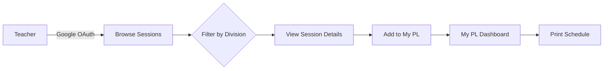
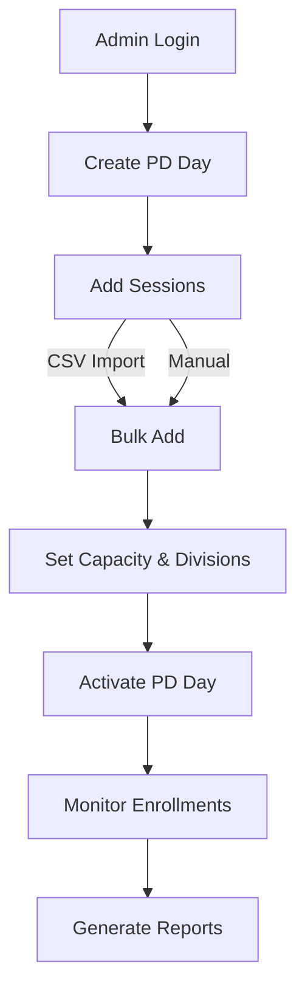

# TLC 2.0 - Professional Learning Management System

A Laravel platform for managing professional development at the American Embassy School. Teachers browse and enroll in PD sessions, administrators coordinate programs with real-time capacity tracking.


## What It Does

TLC 2.0 replaces manual sign-up sheets and email chains with a digital platform where teachers discover division-specific sessions (ES/MS/HS), enroll with one click, and track all their professional learning in one place.

**For Teachers:** Browse sessions → Enroll → View "My PL" schedule → Print
**For Admins:** Create PD Days → Add sessions → Monitor enrollments → Generate reports

## Key Features

- **Unified Session Catalog** - PD Days, Wellness, PL Wednesday, and CCL sessions in one place
- **Division Filtering** - Automatic filtering by Elementary, Middle, or High School
- **My PL Dashboard** - Personal schedule across all enrolled sessions
- **Real-Time Capacity** - Live enrollment counts prevent over-booking
- **One-Click Enrollment** - Add sessions instantly with "Add to My PL"
- **Admin Reports** - Capacity utilization, participant lists, division summaries
- **Bulk Operations** - CSV import, copy sessions between PD Days
- **Feature Toggles** - Enable/disable entire programs globally

## Quick Start

```bash
# Clone and setup
git clone https://github.com/rottnerin/tlcapp.git
cd tlcapp
composer install && npm install

# Configure
cp .env.example .env
php artisan key:generate

# Setup database and run
php artisan migrate --seed
composer dev  # Starts server, queue, logs, Vite
```

Visit `http://localhost:8000`

## System Flow

### User Journey


### Admin Workflow


## Technology Stack

- **Backend:** Laravel 12.x, PHP 8.2+
- **Frontend:** Blade Templates, Tailwind CSS v4, Vite
- **Auth:** Google OAuth (teachers), Email/Password (admins)
- **Database:** SQLite / MySQL / PostgreSQL

## Environment Setup

```env
# Database
DB_CONNECTION=sqlite
DB_DATABASE=/absolute/path/to/database.sqlite

# Google OAuth (Required)
GOOGLE_CLIENT_ID=your-client-id
GOOGLE_CLIENT_SECRET=your-client-secret
GOOGLE_REDIRECT_URI=http://localhost:8000/auth/google/callback
```

## Architecture

**Polymorphic Enrollment System:** `UserSelectedSession` model tracks enrollments across all session types (Schedule Items, Wellness, PL Wednesday, CCL) using polymorphic relationships.

**PD Day States:** Active (visible to teachers), Inactive (hidden, editable), Archived (read-only).

**Feature Toggles:** Global on/off switches for PD Days, Wellness, PL Wednesday, and CCL programs.

## Development

| Command | Purpose |
|---------|---------|
| `composer dev` | Run server + queue + logs + Vite |
| `composer test` | Run PHPUnit tests |
| `./vendor/bin/pint` | Fix code style |

## License

Proprietary software for the American Embassy School.
